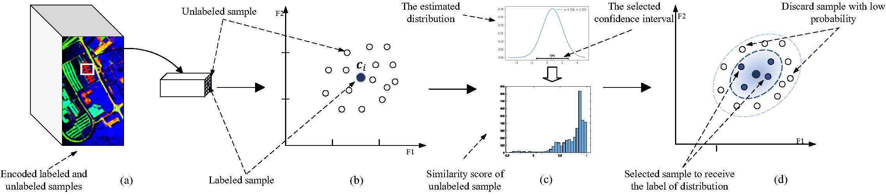

# Semi-Supervised Hyperspectral Image Classification Using a Probabilistic Pseudo-Label Generation Framework
### IEEE Transactions on Geoscience and Remote Sensing (2022)


[](https://paperswithcode.com/sota/semi-supervised-image-classification-on-17?p=semi-supervised-hyperspectral-image-1)


 [Paper](https://ieeexplore.ieee.org/abstract/document/9849704) | [preprint]    

Pytorch implementation of the residual center-based pseudo label generator (Res-CP) for classification of hyperspectral images. Please kindly note that this code cannot reproduce the exact results that reported in this [Paper](https://ieeexplore.ieee.org/abstract/document/9849704). The accuracy results are reported based on Keras-Tensorflow implementation, which will be released soon!



## BibTeX

    @article{seydgar2022semi,
    title={Semi-Supervised Hyperspectral Image Classification Using a Probabilistic Pseudo-Label Generation Framework},
    author={Seydgar, Majid and Rahnamayan, Shahryar and Ghamisi, Pedram and Bidgoli, Azam Asilian},
    journal={IEEE Transactions on Geoscience and Remote Sensing},
    year={2022},
    publisher={IEEE}
    }


## Install
If you have installed [Anaconda](https://www.anaconda.com/) and [Git](https://git-scm.com/download/) on your operating system, simply run the following codes in your terminal (command prompt in Windows).
```bash
# step 1. clone this repo
git clone https://github.com/majidseydgar/Res-CP.git
cd Res-CP

# step 2. create a conda virtual environment and activate it
conda create -n ResCP python=3.6 -y
conda activate ResCP
conda install pytorch torchvision torchaudio cudatoolkit=11.3 -c pytorch
pip install scikit-learn scipy tqdm matplotlib argparse
```
Alternatively, you can manually download the repository, and then install the packages by using pip.
```bash
# Optional solution for step 2: install libs step by step
pip3 install torch torchvision torchaudio --extra-index-url https://download.pytorch.org/whl/cu113
pip install scikit-learn scipy tqdm matplotlib argparse
```


## Model Zoo
- The Res-CP is a semi-supervised learning framework which can generate reliable pseudo labels to enhance the classification results of hyperspectral image classification methods if limited labeled data is available. 
- This framework can achieve more than  **95% OA** for University of Pavia, Salinas, and Kennedy Space Center datasets, respectively, using classification models, such as PRCLSTMII, [SSRN](https://github.com/zilongzhong/SSRN). 
- The embedding features obtained by RCN can be found [here](https://drive.google.com/file/d/1Wr3TYn7-Vsv3MtIa70R6B_-hWOR04Xsh/view?usp=sharing). Put this file in "log/RCN/" and unzip it to reproduce the classification results.
- Stay tuned. More optimized versions of Pytorch implementation and results will be uploaded.


## News & Updates:

- [x] pytorch-based implementation of RCN.
  - [ ] Optimized version uploaded.
- [x] Matlab-based implementation of PLG.
- [ ] Python-based implementation of PLG
- [ ] PRCLSTMII code release.
  - [ ] PRCLSTMII without recurrent regularization.
- [ ] Original keras-tensorflow implementation code release.


## Datasets
The .mat files of the University of Pavia, Salinas, and Kennedy space center are publicly available at: [www.ehu.eus](https://www.ehu.eus/ccwintco/index.php/Hyperspectral_Remote_Sensing_Scenes)
To produce .mat files of University of Houston, please see the [tutorial](https://github.com/shuguang-52/2019-RemoteSens-AUSSC#houston-ground-truth) of Shuguang Dou.\
Place [University of Pavia](https://www.ehu.eus/ccwintco/uploads/e/ee/PaviaU.mat) and its [ground truth](https://www.ehu.eus/ccwintco/uploads/5/50/PaviaU_gt.mat) in "Dataset/UP/" folder.\
Place [Salinas](https://www.ehu.eus/ccwintco/uploads/a/a3/Salinas_corrected.mat) and its [ground truth](https://www.ehu.eus/ccwintco/uploads/f/fa/Salinas_gt.mat) in "Dataset/SA/" folder.\
Place [Kennedy space center](http://www.ehu.es/ccwintco/uploads/2/26/KSC.mat) and its [ground truth](http://www.ehu.es/ccwintco/uploads/a/a6/KSC_gt.mat) in "Dataset/KSC/" folder.\
After generating University of Houston after .mat files, place them in "Dataset/UH/" folder.

## Usage
The framework contains three main components, [1-RCN](https://github.com/majidseydgar/Res-CP/tree/main/1-RCN) for feature embedding (encoding), [2-PLG](https://github.com/majidseydgar/Res-CP/tree/main/2-PLG) for pseudo label generation, and [3-Classifications](https://github.com/majidseydgar/Res-CP/tree/main/3-Classifications) to perform classifications using the generated pseudo labels and test the model on real ground truth.  

You can open the terminal in a main directory (Res-CP)
### 1-RCN (feature encoding) 
If you want to reproduce the embedding features, open the terminal in the main directory ("Res-CP" folder) and then run: 
```bash
# train University of Pavia
python 1-RCN/main.py --dataset SA --emb
```
You can replace UP, KSC, or UH instead of SA after`--dataset` to reproduce the features for other datasets, as well.\
Note that `--emb` flag automatically create "log/1-RCN" parent folder and exports the embedded features in the "log/1-RCN/embeddings" folder.

### 2-PLG (pseudo label generator)
- Currently, you need to have MATLAB to reproduce the PLG results. To do that, simply run the `PLG.m` code; type the name of the dataset (UP, SA, KSC) and press Enter. the pseudo label files `new_train.mat` will be saved in the folder of target dataset.
- Stay tune, Python version will be added soon. 

### 3-Classifications

After generating the pseudo labels, open the terminal in the main directory ("Res-CP" folder) and then run:

```bash
python 3-Classifications/main.py --dataset SA
```
You can add the `--model` flag to change the classification model. Currently, the [SSRN](https://github.com/zilongzhong/SSRN) is a default classification model.\
The [PRCLSTM](https://www.mdpi.com/2072-4292/11/7/883) and the PRCLSTMII will be added soon.


## Acknowledgment

Our implementation is, mainly, based on the following repositories. We gratefully thank the authors for their wonderful works.

[pytorch-center-loss](https://github.com/KaiyangZhou/pytorch-center-loss),
[A2S2K-ResNet](https://github.com/suvojit-0x55aa/A2S2K-ResNet),
[ImageNet-Example](https://github.com/pytorch/examples/tree/main/imagenet),


